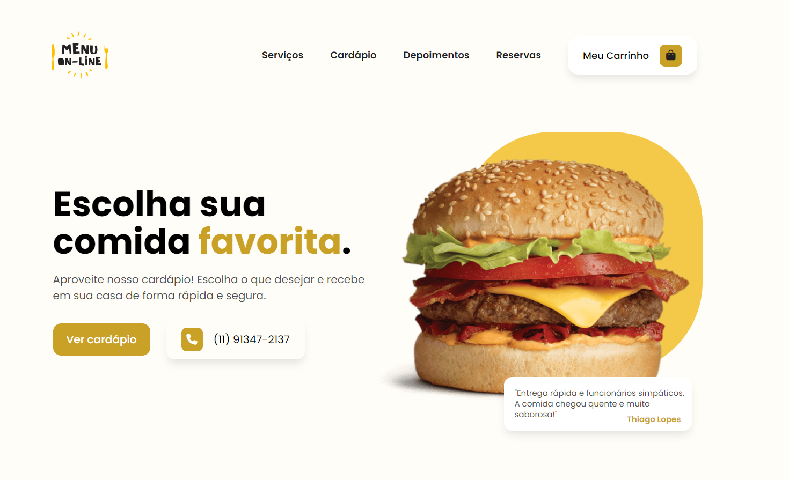
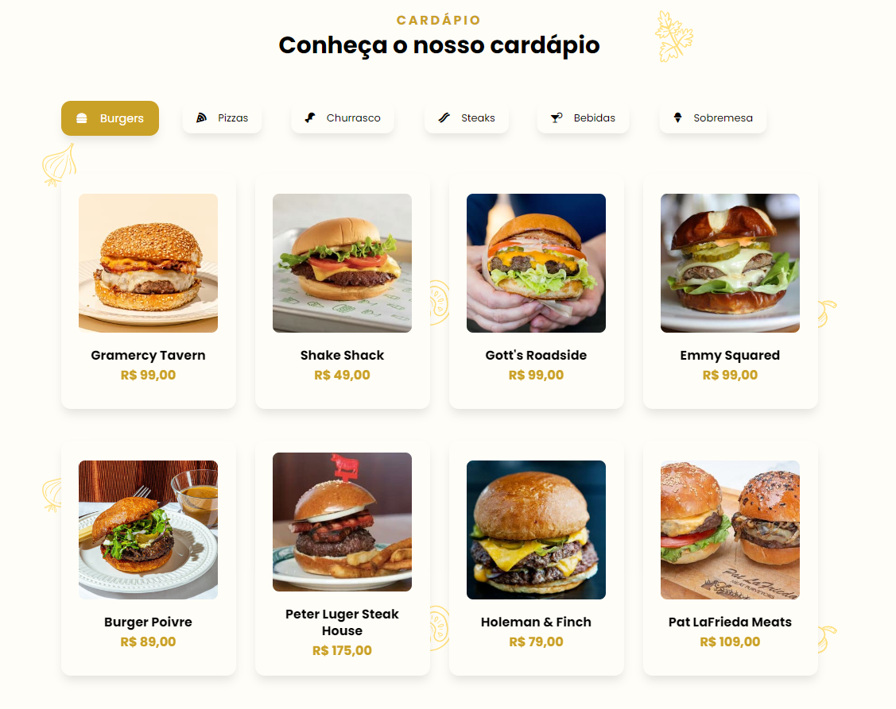

	<h1>Menu On-line 🍔</h1>
	

	  <a href="#about">Sobre o Projeto</a> • 
	  <a href="#functionalities">Funcionali</a> • 
	

	
	

<h2 id="about">📃 Sobre o projeto</h2>

	O projeto $\color{orange}{\textsf{Menu On-line}}$ é uma plataforma digital que permite aos clientes <b>selecionar e encomendar</b> refeições para entrega, focando em <b>praticidade e eficiência</b> no serviço de pedidos online.

<h2 id="functionalities">⚙ Funcionalidades</h2>

- ***Cabeçalho***
  - [x] <b>Abrir e fechar</b> carrinho.</li>
  - [x] Abrir e fechar o <b>menu de navegação</b> em dispositivos menores.</li>
  
   
  
- ***Seção de Cardápio***
  - [x] <b>Alternar entre as seções</b> de alimentos e <b>visualizar informações</b> dos mesmos.
  - [x] Selecionar a <b>quantidade de itens</b> que deseja.
  - [x] <b>Adicionar itens</b> ao carrinho.
  - [x] Visualizar <b>mensagem avisando que o item foi adicionado ao carrinho</b>.

	

